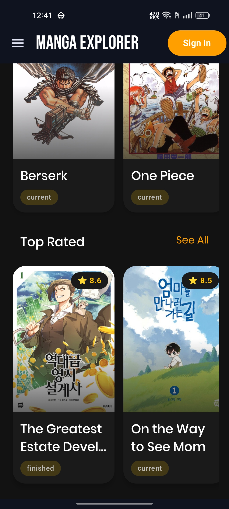
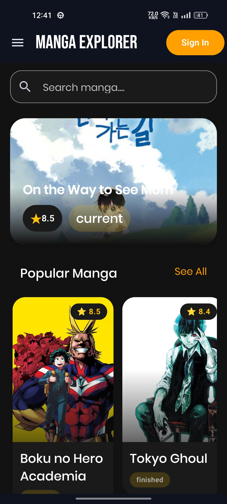
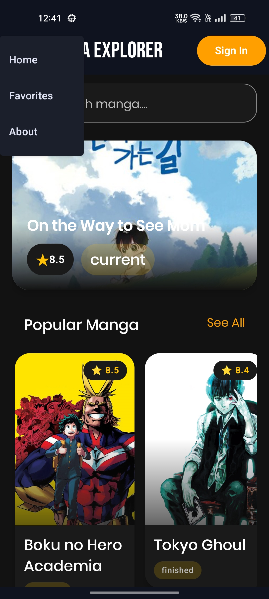
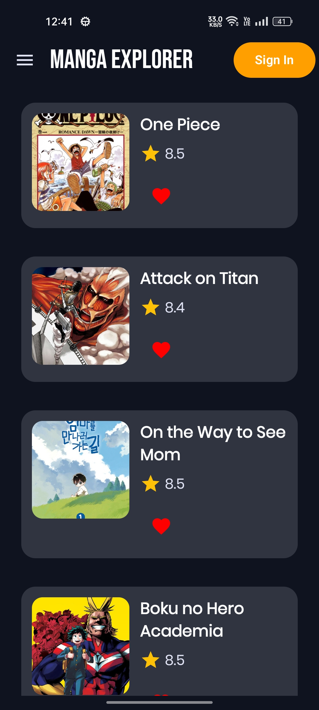
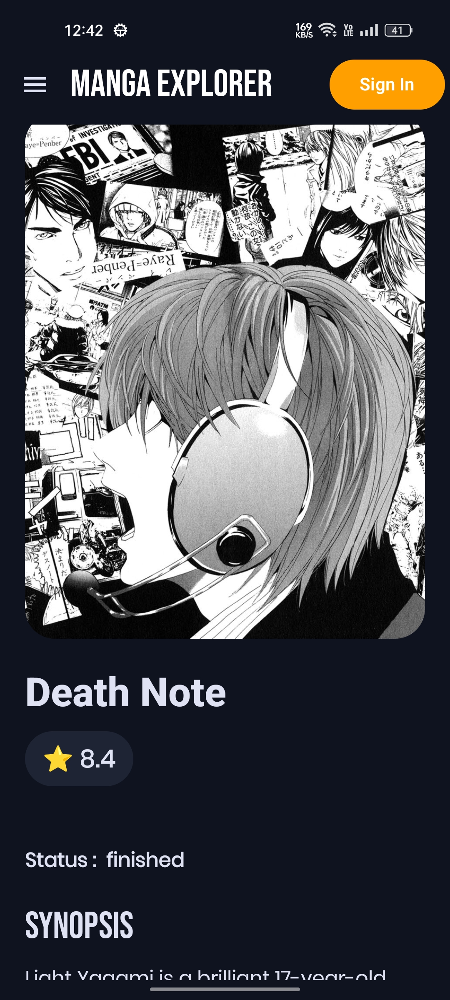
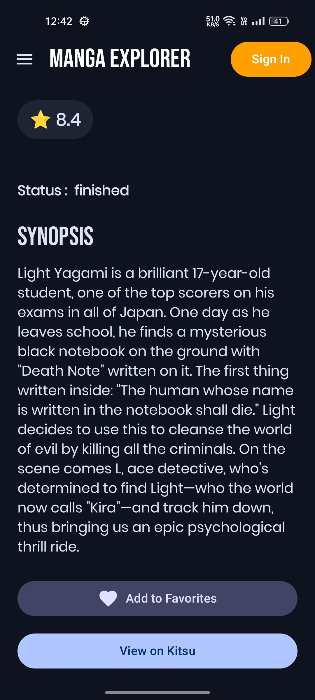
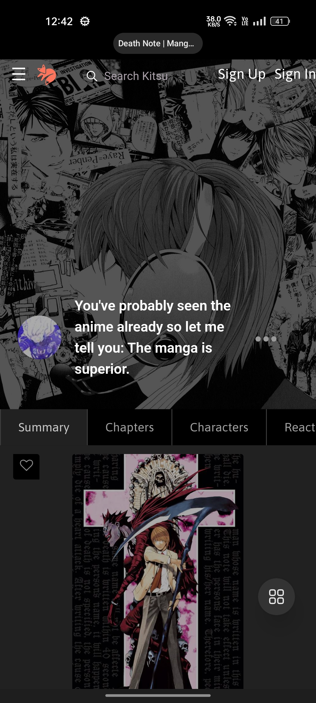
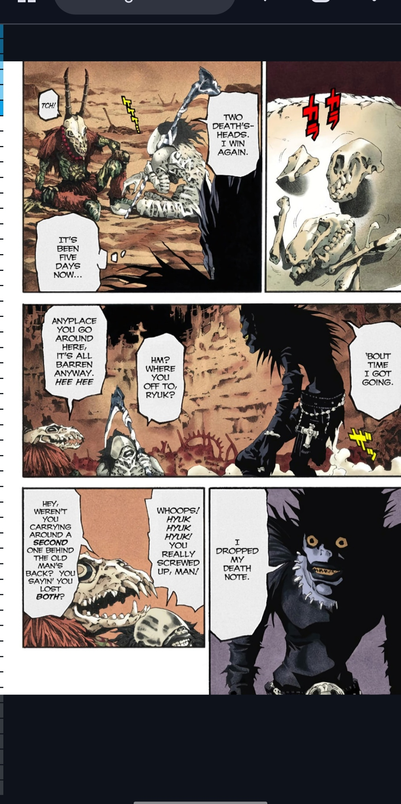

# 📚🔎 Manga Explorer

A modern Android app to explore and discover manga using the Kitsu REST API.

This project was built to improve my Android development fundamentals
while learning MVVM architecture, REST API integration, Jetpack Compose, and Room Database.

---

## ✨ Features

- 🔍 Search Manga
- 📖 Manga Details
- ⭐ Favorites (Room Database)
- 🎨 Modern Jetpack Compose UI
- 📱 Material 3 Design
- ⚡ Fast image loading with Coil
- 🌐 REST API using Retrofit
- 📂 MVVM Architecture

---

## 📸 Screenshots

<h2>Screenshots</h2>

 
 
 
 
 

---

## 🛠 Tech Stack

- Kotlin
- Jetpack Compose
- MVVM
- Retrofit
- Gson
- Coil
- Room Database
- Navigation Compose
- Coroutines
- Material 3

---

## 📂 Architecture

```
UI
   ↓
ViewModel
   ↓
Repository
   ↓
Kitsu REST API
```

---

## 🚀 Getting Started

1. Clone the repository

```
git clone https://github.com/AnishaBisht08/MangaExplorer.git
```

2. Open in Android Studio

3. Sync Gradle

4. Run the app

---

## 🎯 What I Learned

- MVVM Architecture
- State Management
- REST API Integration
- Room Database
- Navigation Compose
- Jetpack Compose UI
- Clean Project Structure

---

## 👩‍💻 Author

**Anisha Bisht**

GitHub:
https://github.com/AnishaBisht08

LinkedIn:
www.linkedin.com/in/anisha-bisht

--
---
---

⭐ If you like this project, feel free to give it a star!
